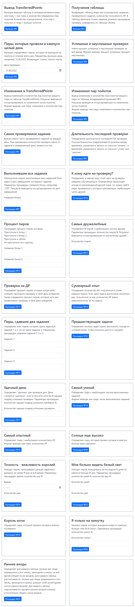

# Java_Info21

Java Web-приложение по управлению и анализу процессов обучения, сбору статистики в Школе 21.\
Приложение реализовано на основе фреймворка **Spring** (**Boot**, **Web**, **MVC**, **Data JPA**), **REST API**, **JDBC**, **Liquibase**, **PostgreSQL**, **Thymeleaf**, **Bootstrap**.\
Пользователю приложения предоставляется возможность выполнения CRUD-операций, импорт/экспорт таблиц из/в CSV файлы, исполнение *процедур* и *функций* по анализу базы данных, выполнение служебных SQL-запросов.
Производится логирование всех действий пользователя при обращении к базе данных.

## Функционал приложения 

- Главная страница содержит:
    - Навигационное меню, обеспечивающее переход к основным разделам приложения: *«Данные»*, *«Операции»*, *«SQL запрос»*
      *«О нас»*.

- Раздел *«Данные»* содержит подразделы, которые позволяют через GUI поддерживать следующий функционал:
    - Совершать CRUD-операции по всем таблицам.
    - При любой модификации таблиц (create, update, delete) приложение запрашивает у пользователя подтверждение на осуществление операции.
    - После любого вида модификации таблиц пользователю выводится измененная таблица.
    - Импорт и экспорт данных для каждой таблицы из файлов/в файлы с расширением *.csv*.

- Раздел *«Операции»* содержит подразделы, которые позволяют через GUI поддерживать следующий функционал:
    - Выбор желаемой процедуры / функции / запроса с выводом результата и возможность экспорта результата в файл разрешения .csv.
    - В случае необходимости введения параметров для выполнения процедуры или функции, графический интерфейс предоставляет форму для ввода данных.

    

- Раздел *«SQL запрос»* позволяет:
    - Выполненять служебные SQL-запросы к базе данных.
    - Если введенный SQL-запрос был некорректен, то приложение обрабатывает подобную ситуацию.

## Таблицы

#### Таблица Peers

- Ник пира
- День рождения

#### Таблица Tasks

- Название задания
- Название задания, являющегося условием входа
- Максимальное количество XP

Чтобы получить доступ к заданию, нужно выполнить задание, являющееся его условием входа.
Для упрощения будем считать, что у каждого задания всего одно условие входа.
В таблице должно быть одно задание, у которого нет условия входа (т.е. поле ParentTask равно null).

#### Таблица P2P

- ID
- ID проверки
- Ник проверяющего пира
- Статус P2P проверки
- Время

Каждая P2P проверка состоит из 2-х записей в таблице: первая имеет статус начало, вторая - успех или неуспех. \
В таблице не может быть больше одной незавершенной P2P проверки, относящейся к конкретному заданию, пиру и проверяющему. \
Каждая P2P проверка (т.е. обе записи, из которых она состоит) ссылается на проверку в таблице Checks, к которой она относится.

#### Таблица Verter

- ID
- ID проверки
- Статус проверки Verter'ом
- Время

Каждая проверка Verter'ом состоит из 2-х записей в таблице: первая имеет статус начало, вторая - успех или неуспех. \
Каждая проверка Verter'ом (т.е. обе записи, из которых она состоит) ссылается на проверку в таблице Checks, к которой она относится. \
Проверка Verter'ом может ссылаться только на те проверки в таблице Checks, которые уже включают в себя успешную P2P проверку.

#### Таблица Checks

- ID
- Ник пира
- Название задания
- Дата проверки

Описывает проверку задания в целом. Проверка обязательно включает в себя **один** этап P2P и, возможно, этап Verter.
Для упрощения будем считать, что пир ту пир и автотесты, относящиеся к одной проверке, всегда происходят в один день.

Проверка считается успешной, если соответствующий P2P этап успешен, а этап Verter успешен, либо отсутствует.
Проверка считается неуспешной, хоть один из этапов неуспешен.
То есть проверки, в которых ещё не завершился этап P2P, или этап P2P успешен, но ещё не завершился этап Verter, не относятся ни к успешным, ни к неуспешным.

#### Таблица TransferredPoints

- ID
- Ник проверяющего пира
- Ник проверяемого пира
- Количество переданных пир поинтов за всё время (только от проверяемого к проверяющему)

При каждой P2P проверке проверяемый пир передаёт один пир поинт проверяющему.
Эта таблица содержит все пары проверяемый-проверяющий и кол-во переданных пир поинтов, то есть,
другими словами, количество P2P проверок указанного проверяемого пира, данным проверяющим.

#### Таблица Friends

- ID
- Ник первого пира
- Ник второго пира

Дружба взаимная, т.е. первый пир является другом второго, а второй -- другом первого.

#### Таблица Recommendations

- ID
- Ник пира
- Ник пира, к которому рекомендуют идти на проверку

Каждому может понравиться, как проходила P2P проверка у того или иного пира.
Пир, указанный в поле Peer, рекомендует проходить P2P проверку у пира из поля RecomendedPeer.
Каждый пир может рекомендовать как ни одного, так и сразу несколько проверяющих.

#### Таблица XP

- ID
- ID проверки
- Количество полученного XP

За каждую успешную проверку пир, выполнивший задание, получает какое-то количество XP, отображаемое в этой таблице.
Количество XP не может превышать максимальное доступное для проверяемой задачи.
Первое поле этой таблицы может ссылаться только на успешные проверки.

#### Таблица TimeTracking

- ID
- Ник пира
- Дата
- Время
- Состояние (1 - пришел, 2 - вышел)

Данная таблица содержит информация о посещениях пирами кампуса.
Когда пир входит в кампус, в таблицу добавляется запись с состоянием 1, когда покидает - с состоянием 2.

Под действием "выходить" подразумеваются все покидания кампуса за день, кроме последнего.
В течение одного дня должно быть одинаковое количество записей с состоянием 1 и состоянием 2 для каждого пира.

## Диаграмма (Entity-Relationship Diagram)

